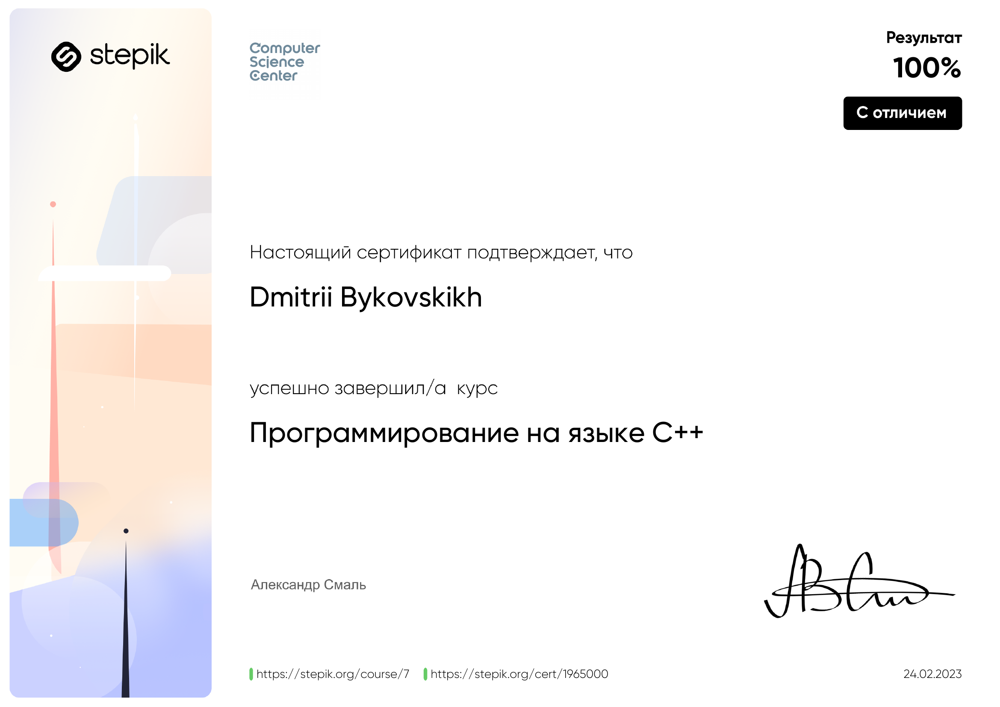

<!--
##### [sci-d3v.github.io](https://sci-d3v.github.io/)
-->
# Быковских Дмитрий Александрович

sci.d3v@gmail.com

#### Инженер-программист, к.ф.-м.н.

10+ лет опыта разработки прикладных приложений с применением различных языков программирования.

5+ лет опыта преподавания математических и технических дисциплин в СурГУ.

5+ лет опыта научных исследований, включая написание статей и разработку научно-прикладных приложений.

## Навыки

Языки программирования: С/C++, Python, GLSL, SQL, C#, Pascal.

Стек технологий: Linux, OpenGL, OpenMP, MPI, CUDA, OpenCL, Latex, GIT.

Дополнительные навыки: Написание научных статей, преподавание.

Языки: Русский (родной), Английский (B2, Upper Intermediate)

##### Профиль в онлайн тренажере с решенными задачами на различные темы
##### [codewars.com/users/sci.d3v](https://www.codewars.com/users/sci.d3v)

##### Список публикаций
##### [elibrary.ru/author_items.asp?authorid=1094546](https://elibrary.ru/author_items.asp?authorid=1094546)

## Образование

В июне 2022 г. защитил кандидатскую диссертацию на тему "Моделирование течение газа Кнудсена в трехмерной области методом Монте-Карло" по специальности 1.2.2. Математическое моделирование, численные методы и комплексы программ (физико-математические науки) в диссертационном совете на базе ТюмГУ.

В 2016 г. окончил аспирантуру.

В 2013 г. окончил кафедру АСОИУ (Автоматизированные системы обработки информации и управления) ГБОУ ВПО "Сургутский государственный университет Ханты-Мансийского автономного округа - Югры" с присуждением квалификации инженер по специальности АСОИУ.

В 2008 г. окончил школу с серебряной медалью.

## Работа

### С февраля 2023 г. по настоящее время старший преподаватель (дистанционно, доля ставки)
Преподаю следующие дисциплины: "Дискретная математика", "Математическая логика и теория алгоритмов".

### С января 2021 г. по январь 2023 г. старший преподаватель
Преподавал следующие дисциплины на кафедрах ПМ и ИВТ: "Компьютерная графика", "Дискретная математика", "Математическая логика и теория алгоритмов", "Высшая математика", "Математический анализ".
Самостоятельно разработал курс "Компьютерная графика", в котором знакомил студентов со стандартом OpenGL, а также основами разработки приложений с использованием всех основных шейдеров, написанных на языке GLSL.

### C сентября 2014 г. по декабрь 2020 г. инженер-программист
Работал в научных и исследовательских центрах университета, где занимался разработкой научного программного обеспечения для современных высокопроизводительных вычислительных систем, а также написанием тезисов, статей, монографий, диссертации, связанных с разработкой программного обеспечения. Активно выступал с докладами на конференциях в городах России.

### C сентября 2014 г. по декабрь 2020 г. старший преподаватель (совместитель)
Работал кафедрах ПМ, АСОИУ и ИВТ  в СурГУ, где преподавал следующие дисциплины:
"Компьютерная графика", "Численные методы/Вычислительная математика", "Математический анализ", "Высшая математика", "Дифференциальные уравнения", "Теория функций комплексного переменного", "Математические модели в экономике", "Современные промышленные СУБД", "Языки и методы программирования" и др.

## Повышение квалификации

В феврале 2023 г. успешно завершил онлайн-курс "Программирование на языке C++", основанный на материалах курсов, которые в разное время читались в Академическом университете и Computer Science центре. Автором курса является А. Смаль. ([ссылка на сертификат](certificates/2023-stepik_cpp.png))
<!--

-->

С сентября 2021 г. по ноябрь 2022 г. занимался в английской школе Lingua уровень B2 (Upper Intermediate).

В декабре 2017 г. успешно сдал Кембриджский экзамен Preliminary English Test (PET) по английскому языку, подтвердив уровень B1 (Intermediate).
([ссылка на сертификат](certificates/2018-CE_PET_1.png))

В июне 2015 г. успешно прошел курс обучения суперкомпьютерным технологиям по направлению "Технологии параллельного программирования MPI и OpenMP" в рамках учебной программы Международной Летней Суперкомпьютерной Академии, руководителем которой учебной программы являлся Вл.В. Воеводин, в МГУ им. М.В. Ломоносова.
([ссылка на сертификат](certificates/2015-SSCA.png))

В июне 2014 г. успешно прошел курс "Параллельное программирование для графических ускорителей на языке Фортран" с применением технологии CUDA. Автором курса являлся Б.П. Рыбакин.
([ссылка на сертификат](certificates/2014-FC_2.png))

В феврале 2014 г. успешно прошел стажировку в ФГБУН НИИСИ РАН по направлению "Введение в современные параллельные вычисления".
([ссылка на сертификат](certificates/2014-SRISARAS.png))
